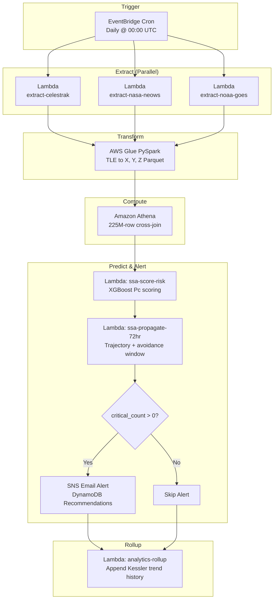

<div align="center">

# Kessler Syndrome Early Warning System

### AWS Cloud-Native Real-Time Space Situational Awareness Pipeline

[](https://aws.amazon.com/)
[](https://www.python.org/)
[](https://aws.amazon.com/athena/)
[](https://aws.amazon.com/step-functions/)
[](./LICENSE)
[]()

*A fully automated, serverless pipeline that ingests live orbital telemetry, computes 225M+ pairwise satellite distances, and fires real-time collision-risk alerts, end to end in under 6 minutes.*

<!-- Hero shot / banner of the Mission Control dashboard (full-page screenshot, dark theme) -->


</div>

---

## Table of Contents

- [Overview](#overview)
- [Key Results](#key-results)
- [Dashboard Preview](#dashboard-preview)
- [System Architecture](#system-architecture)
- [Pipeline Flow](#pipeline-flow)
- [Tech Stack](#tech-stack)
- [Data Sources](#data-sources)
- [Medallion Architecture (Bronze, Silver, Gold)](#medallion-architecture-bronze-silver-gold)
- [Core Computation](#core-computation-225m-row-cross-join)
- [Prediction, Alert and Recommendation Layer](#prediction-alert-and-recommendation-layer)
- [API Reference](#api-reference)
- [Dashboard Panels](#dashboard-panels)
- [Getting Started / Deployment](#getting-started--deployment)
- [Cost](#cost)
- [Repository Structure](#repository-structure)
- [Limitations](#limitations)
- [Future Work](#future-work)
- [Team](#team)
- [References](#references)
- [License](#license)

---

## Overview

The **Kessler Syndrome Early Warning System (SSA-EWS)** is an end-to-end, cloud-native data engineering pipeline that brings real Space Situational Awareness capability down to a student budget. It ingests live orbital telemetry from three independent public aerospace APIs, converts raw Two-Line Element (TLE) data into geocentric Cartesian coordinates using the **SGP4/SDP4 propagation model**, and runs a **225-million-row pairwise distance computation** on a serverless cloud data warehouse to detect satellite conjunction (near-collision) events.

The entire pipeline is orchestrated by **AWS Step Functions**, triggered nightly by **EventBridge**, and requires zero manual intervention. When a critical conjunction is detected, the system automatically:

1. Scores the collision probability (Pc) using a SageMaker XGBoost model
2. Projects both satellites' trajectories 72 hours forward
3. Computes the optimal avoidance maneuver window
4. Fires an **SNS email alert**
5. Surfaces everything on a live, mission-control-style web dashboard

> Named after the 1978 Kessler Syndrome hypothesis (Kessler & Cour-Palais), which predicted that orbital debris density in LEO could reach a tipping point of cascading collisions. This project is a small, quantitative attempt to monitor that tipping point in near-real-time.

---

## Key Results

Metrics from the latest pipeline run:

| Metric | Value |
|---|---|
| Total active satellites ingested | **15,008** |
| Total pairwise comparisons executed | **~225.2M** (N x (N-1) ordered pairs) |
| Conjunction events detected (< 50 km) | **586** |
| Critical events (< 10 km) | **83** |
| Caution events (10-30 km) | **247** |
| Safe events (30-50 km) | **256** |
| Closest observed miss distance | **0.0025 km** (2.5 metres) |
| Pipeline end-to-end runtime | **~6 minutes** |
| Gold layer tables materialised | **6** |
| API endpoints live | **7** |
| Estimated monthly AWS cost | **< $3.00** (within $100 AWS credit allocation) |

---

## Dashboard Preview

<!-- Orbital Density Heatmap + Kessler Index Trend + Distance Distribution + NEO Monitor (bottom half of dashboard) -->


<!-- Sample SNS critical alert email -->


---

## System Architecture

The pipeline follows a modern **ELT (Extract, Load, Transform)** pattern across five logical layers, each implemented with a dedicated AWS service. The architecture is fully event-driven: a nightly EventBridge cron trigger fires a Step Functions state machine that orchestrates each stage sequentially, with parallel extraction at the start.

<!-- AWS infrastructure diagram (e.g. exported from CloudFormation/Infrastructure Composer or draw.io) -->


### Layer Summary

| Layer | AWS Service(s) | Role |
|---|---|---|
| **Extraction** | Lambda (x3) + EventBridge | Ingest raw data from 3 public APIs into S3 `bronze/` |
| **Transformation** | AWS Glue (PySpark) | SGP4 propagation: TLE orbital params to X, Y, Z km |
| **Compute** | Amazon Athena + S3 Parquet | 225M-row cross-join SQL; materialise fact tables |
| **Prediction & Alert** | Lambda + SageMaker + SNS | Pc scoring, 72-hr trajectory, avoidance windows, email alerts |
| **Presentation** | API Gateway + Lambda + CloudFront | REST API + static mission-control dashboard |
| **Orchestration** | Step Functions + CloudWatch | Pipeline sequencing, monitoring, failure alerting |

---

## Pipeline Flow



---

## Tech Stack

**Cloud / Orchestration**
- AWS Step Functions, AWS EventBridge, Amazon CloudWatch

**Data Ingestion & Storage**
- AWS Lambda (Python), Amazon S3 (bronze / silver / gold), Apache Parquet

**Transformation & Compute**
- AWS Glue (PySpark), Skyfield (SGP4/SDP4 propagation), Amazon Athena (CTAS SQL)

**ML / Prediction**
- Amazon SageMaker (XGBoost), Vis-viva orbital mechanics approximation

**Alerting & Storage**
- Amazon SNS, Amazon DynamoDB

**API & Frontend**
- Amazon API Gateway (HTTP API), AWS Lambda, Amazon CloudFront, Vanilla HTML/CSS/JavaScript (SVG dashboard)

**Region:** `ap-south-1` (Mumbai)

---

## Data Sources

Three independent Lambda functions run in **parallel**, each targeting a distinct public aerospace API. Raw outputs land in S3 under `bronze/`, partitioned by `run_date`.

### 1. CelesTrak Active Satellite Catalogue

| Property | Detail |
|---|---|
| Source | CelesTrak / US DoD Space Surveillance Network |
| Endpoint | `celestrak.org/NORAD/elements/gp.php?GROUP=active&FORMAT=tle` |
| Format | Fixed-width TLE text (69 chars/line) |
| Volume | 15,008 active satellite records |
| S3 destination | `s3://<bucket>/bronze/satellites/run_date=YYYY-MM-DD/raw.txt` |
| Lambda | `ssa-extract-celestrak`, 256 MB, 60s timeout |

TLE fields are extracted using exact character-index slices:

```python
name  = raw_text[i].strip()
line1 = raw_text[i+1].strip()
line2 = raw_text[i+2].strip()

sat_number   = line1[2:7].strip()    # NORAD catalogue ID
inclination  = line2[8:16].strip()   # degrees from equatorial plane
eccentricity = line2[26:33].strip()  # encoded without decimal point
mean_motion  = line2[52:63].strip()  # revolutions per day
```

<!-- S3 console screenshot of raw bronze layer JSON (e.g. active_satellites_raw.json) -->


### 2. NASA NeoWs (Near-Earth Object Web Service)

| Property | Detail |
|---|---|
| Source | NASA Jet Propulsion Laboratory |
| Endpoint | `api.nasa.gov/neo/rest/v1/feed?start_date=...&end_date=...` |
| Format | Nested JSON with `close_approach_data` arrays |
| Volume | ~95 records / 7-day rolling window |
| Key fields | `name`, `miss_distance_km`, `relative_velocity_kph`, `is_potentially_hazardous`, `close_approach_date` |
| S3 destination | `s3://<bucket>/bronze/asteroids/run_date=YYYY-MM-DD/neo.json` |

### 3. NOAA GOES-16 Solar X-Ray Flux

| Property | Detail |
|---|---|
| Source | NOAA Space Weather Prediction Center |
| Endpoint | `services.swpc.noaa.gov/json/goes/primary/xrays-7-day.json` |
| Format | JSON array of timestamped flux readings |
| Volume | ~20,154 readings (7-day window, 1-min cadence) |
| Key fields | `time_tag`, `flux` (W/m2), energy band (0.05-0.4 nm / 0.1-0.8 nm) |
| S3 destination | `s3://<bucket>/bronze/weather/run_date=YYYY-MM-DD/flux.json` |

---

## Medallion Architecture (Bronze, Silver, Gold)

### Silver Layer: Transformation Engine

A **Glue PySpark** job reads raw TLE text from `bronze/`, applies **SGP4 orbital propagation** via the [Skyfield](https://rhodesmill.org/skyfield/) library, and outputs each satellite's geocentric Cartesian position (ECI frame) to `silver/`.

TLE data encodes orbital *shape and orientation*, not physical location. To compute the distance between two satellites at a given instant, both must be expressed in a common Cartesian reference frame. SGP4 numerically integrates the equations of motion forward from the TLE epoch to the current time.

```python
from skyfield.api import load, EarthSatellite
import numpy as np

ts = load.timescale()
t = ts.now()  # propagate to current UTC

for row in satellite_df.itertuples():
    try:
        sat = EarthSatellite(row.line1, row.line2, row.name, ts)
        pos = sat.at(t).position.km  # [X_km, Y_km, Z_km] ECI frame
        if np.isnan(pos[0]):
            raise ValueError("SGP4 math domain error")
        good.append({**row, "x_km": pos[0], "y_km": pos[1], "z_km": pos[2]})
    except Exception as e:
        quarantine.append({**row, "reason": str(e)})  # audited separately
```

**Data Quality, Quarantine Layer:** TLE records that produce `NaN` positions (decayed satellites still present in the public catalogue) are routed to a separate quarantine path instead of being silently discarded. A CloudWatch custom metric tracks the quarantine rate per run.

| Output | S3 Path | Format | Typical Volume |
|---|---|---|---|
| Clean records | `silver/satellites_xyz/run_date=.../part-*.parquet` | Parquet | ~14,800 records |
| Quarantined | `silver/quarantine/run_date=.../bad_tles.json` | JSON | ~200 records |

A **Glue Crawler** runs after the job completes, scanning `silver/satellites_xyz/` and registering the schema into the `ssa_silver` Glue Data Catalog database, making the table immediately queryable from Athena without manual DDL.

<!-- S3 console screenshot of a silver-layer Parquet part-file -->


---

## Core Computation: 225M-Row Cross-Join

### The Computational Challenge

Assessing collision risk requires comparing **every satellite against every other satellite simultaneously**. With 15,008 objects, the total number of unique ordered pairs is `N x (N-1) = 225,240,056` comparisons. Loading this Cartesian product into local RAM would require tens of gigabytes, so the computation is delegated entirely to **Amazon Athena**, which executes the query against columnar Parquet files in S3 using distributed compute. The `WHERE` clause filtering to `< 50 km` means the materialised output contains only ~586 rows despite the 225-million-row intermediate.

```sql
CREATE TABLE ssa_gold.fact_collision_risks
WITH (format = 'PARQUET',
      location = 's3://<bucket>/gold/fact_collision_risks/')
AS
SELECT
    a.satellite_name AS target_sat,
    b.satellite_name AS threat_sat,
    SQRT( POW(a.x_km - b.x_km, 2)
        + POW(a.y_km - b.y_km, 2)
        + POW(a.z_km - b.z_km, 2) ) AS distance_km,
    CASE
        WHEN dist < 10 THEN 'CRITICAL'
        WHEN dist < 30 THEN 'CAUTION'
        ELSE                'SAFE'
    END AS risk_level
FROM   ssa_silver.satellites_xyz a
JOIN   ssa_silver.satellites_xyz b
    ON a.satellite_number != b.satellite_number
WHERE  SQRT( POW(a.x_km-b.x_km,2) + POW(a.y_km-b.y_km,2) + POW(a.z_km-b.z_km,2) ) < 50
ORDER  BY distance_km ASC;
```

### Gold Layer Tables

| Table | Source Query | Rows (typical) | Purpose |
|---|---|---|---|
| `fact_collision_risks` | Cross-join on `silver/satellites_xyz` | 586 | All pairs within 50 km, risk-classified |
| `orbital_density` | Altitude band grouping on silver | 8 bands | Satellite count per 200 km shell |
| `distance_distribution` | Histogram bucketing of distances | 5 buckets | CRITICAL / CAUTION / SAFE breakdown |
| `most_dangerous_satellites` | Aggregation on `fact_collision_risks` | Top 100 | Conjunction count per satellite |
| `conjunction_trends` | Nightly append (historical) | Grows daily | Kessler Index time series |
| `risk_summary` | Aggregate of `fact_collision_risks` | 1 row/day | Summary stats for dashboard strip |

<!-- Athena query editor screenshot showing conjunction_trends results -->


---

## Prediction, Alert and Recommendation Layer

Detection alone is insufficient for an *operational* warning system. This layer extends every **CRITICAL** conjunction event with a physics-based collision probability score, a 72-hour forward trajectory projection, and a computed avoidance maneuver window.

### Collision Probability Scoring (`ssa-score-risk`)

A **SageMaker XGBoost** model is trained on historical TLE epoch pairs. Features include miss distance, relative orbital velocity (derived from TLE mean-motion difference), inclination delta, altitude band, and eccentricity. The model outputs a collision probability score **Pc** (0-1) per conjunction pair. The model artifact is exported to S3 and loaded inside a Lambda for batch inference, avoiding any persistent SageMaker endpoint cost.

| Risk Level | Distance Threshold | Dashboard Indicator | Action Triggered |
|---|---|---|---|
| CRITICAL | < 10 km | Flashing red badge | SNS email + Recommendation written |
| CAUTION | 10-30 km | Amber badge | Dashboard highlight only |
| SAFE | 30-50 km | Green badge | No action |

### 72-Hour Trajectory Propagation (`ssa-propagate-72hr`)

For every CRITICAL pair, the Lambda propagates both satellites' positions forward in 3-hour steps for 72 hours using a **vis-viva orbital mechanics approximation**, identifying the predicted closest-approach hour and the optimal maneuver window (max separation within the first 24 hours, minimising the delta-V required for an avoidance burn).

```python
# Vis-viva velocity approximation (tangential, ECI frame)
def approx_velocity(x, y, z):
    r = sqrt(x**2 + y**2 + z**2)
    v = sqrt(398600 / r)  # km/s, Earth GM = 398600 km^3/s^2
    return (-y/r * v, x/r * v, 0.0)

# Propagate forward in 3-hour steps
for h in range(0, 73, 3):
    px = x + vx * 3600 * h
    py = y + vy * 3600 * h
    dist = sqrt((px-qx)**2 + (py-qy)**2 + (pz-qz)**2)
```

Output is written to both the `Trajectories72hr` and `Recommendations` DynamoDB tables, and exposed via the `/recommendations` API endpoint.

### Automated Alert via SNS Email

The Step Functions **Choice** state evaluates `critical_count` from the compute stage output. If greater than zero, it invokes the alert Lambda, which publishes to an SNS topic:

> **Sample Recommendation Output**
> Optimal maneuver window at T+12hr when separation is 45.2 km. Closest approach predicted at T+6hr (0.0025 km). Execute delta-V burn before T+0hr.
> `[Target: COSMOS-2251 | Threat: IRIDIUM-33 | Pc: 0.61]`

---

## API Reference

REST API backed by API Gateway + Lambda, querying the Athena gold tables. All endpoints return data within ~300ms after the nightly pipeline completes.

| Method | Route | Data Source | Description |
|---|---|---|---|
| `GET` | `/conjunctions` | `ssa_gold.fact_collision_risks` | Top 20 closest satellite pairs with risk level |
| `GET` | `/summary` | `ssa_gold.risk_summary` | Critical/caution/safe counts, closest approach distance |
| `GET` | `/density` | `ssa_gold.orbital_density` | Satellite count per altitude band |
| `GET` | `/distribution` | `ssa_gold.distance_distribution` | Histogram of miss distances |
| `GET` | `/dangerous` | `ssa_gold.most_dangerous_satellites` | Top 10 satellites by conjunction count |
| `GET` | `/trends` | `ssa_gold.conjunction_trends` | Historical Kessler Index (nightly appended) |
| `GET` | `/recommendations` | DynamoDB `Recommendations` | 72-hr avoidance windows for CRITICAL pairs |

**Base URL:** `https://<api-id>.execute-api.ap-south-1.amazonaws.com/prod`

---

## Dashboard Panels

The frontend is a custom HTML/CSS/JavaScript single-page application styled after an operational mission-control interface, hosted as a static site on S3 and served globally via CloudFront. It consists of seven panels arranged in a responsive CSS grid:

- **Status Strip**: Four summary cards displaying critical count, total conjunctions, closest approach distance, and average miss distance (`/summary`).
- **Orbital Conjunction Risk Assessment**: Top 20 closest satellite pairs with target/threat names, miss distance, proximity bar, and flashing risk badge.
- **Conjunction Radar**: Animated SVG radar with blips positioned proportionally to distance from the 50 km threshold ring.
- **Orbital Density Heatmap**: Horizontal bar chart of satellite count per 200 km altitude band, LEO to GEO.
- **Kessler Index Trend**: Line chart of nightly conjunction counts over time, with CRITICAL events as a dashed red series.
- **Distance Distribution Histogram**: Bar chart of CRITICAL/CAUTION/SAFE pair counts.
- **Near-Earth Object Monitor**: Live asteroid close-approach list from NASA NeoWs, sorted by miss distance (Lunar Distances), with Potentially Hazardous Object flags.

---

## Getting Started / Deployment

> **Note:** This project was deployed manually through the AWS Console during development. The steps below outline the general path to reproduce it. Adapt resource names, IAM policies, and IaC tooling (Terraform/CDK/SAM) to your own setup.

### Prerequisites

- AWS Account with billing alerts configured (this pipeline runs comfortably in the AWS Free Tier / a student credit)
- AWS CLI configured (`aws configure`) with a user/role that has permissions for Lambda, Glue, Athena, S3, Step Functions, EventBridge, SNS, DynamoDB, API Gateway, CloudFront, and SageMaker
- Python 3.10+
- A free [NASA API key](https://api.nasa.gov/) for the NeoWs endpoint
- `pip install skyfield boto3 pandas`

### 1. Clone the repository

```bash
git clone https://github.com/Bipul20000/satellite_collision_aws_data_pipleine.git
cd satellite_collision_aws_data_pipleine
```

### 2. Configure environment variables

Create a `.env` file (or set as Lambda environment variables):

```bash
AWS_REGION=ap-south-1
S3_BUCKET=ssa-kessler-<your-suffix>
NASA_API_KEY=<your-nasa-api-key>
ALERT_EMAIL=<your-email>
```

### 3. Provision S3 buckets and prefixes

```bash
aws s3 mb s3://$S3_BUCKET --region ap-south-1
aws s3api put-object --bucket $S3_BUCKET --key bronze/
aws s3api put-object --bucket $S3_BUCKET --key silver/
aws s3api put-object --bucket $S3_BUCKET --key gold/
```

### 4. Deploy the extraction Lambdas

```bash
# Package and deploy each extraction function
cd lambdas/ssa-extract-celestrak && zip -r function.zip . && \
  aws lambda create-function --function-name ssa-extract-celestrak \
  --runtime python3.10 --handler handler.lambda_handler \
  --zip-file fileb://function.zip --role <your-lambda-execution-role-arn>
# Repeat for ssa-extract-nasa-neows and ssa-extract-noaa-goes
```

### 5. Deploy the Glue transformation job

Upload `transform_orbit.py` to S3 and create a Glue Job (Python 3, G.1X worker type, 2 DPU) pointing at it, with the Skyfield library packaged as a `--additional-python-modules` argument or a Glue Python wheel.

### 6. Register the Athena Gold layer

Run a Glue Crawler against `silver/satellites_xyz/`, then execute the CTAS queries in `sql/gold_layer/` (one per gold table) via the Athena console or `aws athena start-query-execution`.

### 7. Deploy prediction and alert Lambdas

Deploy `ssa-score-risk`, `ssa-propagate-72hr`, and the SNS-publishing alert Lambda. Create an SNS topic and subscribe your email:

```bash
aws sns create-topic --name ssa-critical-alerts
aws sns subscribe --topic-arn <topic-arn> --protocol email --notification-endpoint $ALERT_EMAIL
```

### 8. Wire up the Step Functions state machine

Deploy the state machine defined in `stepfunctions/ssa-pipeline.asl.json`, matching the [Pipeline Flow](#pipeline-flow) above.

### 9. Schedule with EventBridge

```bash
aws events put-rule --name ssa-nightly-trigger --schedule-expression "cron(0 0 * * ? *)"
```

### 10. Deploy the API and Dashboard

Deploy the `/conjunctions`, `/summary`, `/density`, `/distribution`, `/dangerous`, `/trends`, and `/recommendations` Lambda-backed routes via API Gateway (HTTP API), then upload `frontend/` to an S3 static-hosting bucket and front it with a CloudFront distribution.

### 11. Run it

```bash
aws stepfunctions start-execution --state-machine-arn <your-state-machine-arn>
```

<!-- Step Functions execution graph (successful run, green path) -->


---

## Cost

| Item | Notes |
|---|---|
| Estimated monthly cost | **< $3.00** |
| Budget allocation | Within a **$100 AWS credit** allocation |
| Biggest cost driver | Athena data scanned per query (mitigated by Parquet + column pruning) |
| Cost-saving choices | No persistent SageMaker endpoint (batch inference via Lambda); S3 + CloudFront static hosting instead of a server; on-demand DynamoDB |

<!-- AWS Cost Explorer or Budgets screenshot for the project account -->


---

## Repository Structure

> Suggested layout. Adjust to match your actual repo before publishing.

```
satellite_collision_aws_data_pipleine/
├── lambdas/
│   ├── ssa-extract-celestrak/
│   ├── ssa-extract-nasa-neows/
│   ├── ssa-extract-noaa-goes/
│   ├── ssa-compute-duckdb/
│   ├── ssa-score-risk/
│   ├── ssa-propagate-72hr/
│   ├── ssa-alert/
│   ├── analytics-rollup/
│   └── ssa-api-read/
├── glue/
│   └── transform_orbit.py
├── sql/
│   └── gold_layer/
│       ├── fact_collision_risks.sql
│       ├── orbital_density.sql
│       ├── distance_distribution.sql
│       ├── most_dangerous_satellites.sql
│       ├── conjunction_trends.sql
│       └── risk_summary.sql
├── stepfunctions/
│   └── ssa-pipeline.asl.json
├── frontend/
│   ├── index.html
│   ├── style.css
│   └── dashboard.js
├── docs/
│   └── images/
├── models/
│   └── xgboost_pc_model.tar.gz
├── .env.example
├── LICENSE
└── README.md
```

---

## Limitations

- The conjunction analysis uses **instantaneous positional snapshots**. Operational SSA uses covariance-based Probability of Collision (Pc) calculations accounting for full positional uncertainty ellipsoids; this project uses a simplified Gaussian miss-distance Pc model.
- The 72-hour trajectory propagation uses a **constant-velocity tangential approximation** rather than full multi-step SGP4 integration. For high-eccentricity or high-drag orbits, this diverges from the true trajectory after approximately 12 hours.
- Zero-distance readings for co-located station modules (ISS, CSS) should be filtered using a docking registry grouped by COSPAR base designator.
- The system depends on three external public APIs with **no retry logic or schema validation** beyond basic exception handling.
- Solar-drag correlation analysis (NOAA X-ray flux vs. average LEO altitude decay) was designed but not implemented in the current pipeline run.

---

## Future Work

- [ ] Implement full multi-step SGP4 propagation over 72 hours for accurate trajectory forecasting
- [ ] Add covariance matrix integration (Alfriend or Foster methods) for operational Pc values
- [ ] Build a Three.js 3D orbital globe visualisation rendering live satellite positions
- [ ] Extend ingestion to uncatalogued debris from radar observation networks
- [ ] Implement the solar-drag correlation dashboard panel using NOAA flux history

---

## Team

| Name | Roll No. | Role |
|---|---|---|
| **Bipul Kumar** | 23/IT/044 | Data Engineering Pipeline, AWS Infrastructure |
| **Ayush Surana** | 23/IT/041 | Data Engineering Pipeline, AWS Infrastructure |

B.Tech Information Technology, Delhi Technological University
Course: *Data Engineering and Analytics (IT-302m)*, Academic Year 2025-2026

---

## References

1. Kessler, D.J. and Cour-Palais, B.G. (1978). *Collision Frequency of Artificial Satellites*. Journal of Geophysical Research, 83(A6), 2637-2646.
2. CelesTrak (2024). *NORAD GP Element Sets*. [celestrak.org/NORAD/elements](https://celestrak.org/NORAD/elements/)
3. NASA JPL (2024). *NeoWs API Documentation*. [api.nasa.gov](https://api.nasa.gov/)
4. NOAA SWPC (2024). *GOES-16 Solar X-Ray Flux Feed*. [services.swpc.noaa.gov](https://services.swpc.noaa.gov/)
5. Rhodes, B. (2019). *Skyfield: High Precision Positions for Earth Satellites*. ascl:1907.024.
6. AWS Documentation (2024). *Amazon Athena, AWS Glue, Step Functions, Lambda, API Gateway*.
7. Hoots, F.R. and Roehrich, R.L. (1980). *Models for Propagation of NORAD Element Sets*. Spacetrack Report No. 3.

---

## License

This project is licensed under the [MIT License](./LICENSE).

---

<div align="center">

*Built to answer, quantitatively, the question Donald Kessler first posed in 1978: is orbital congestion in LEO getting worse?*

</div>
